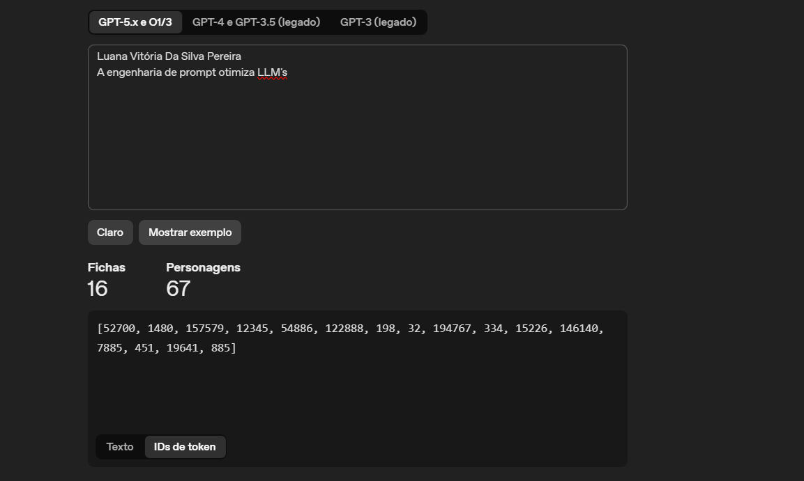
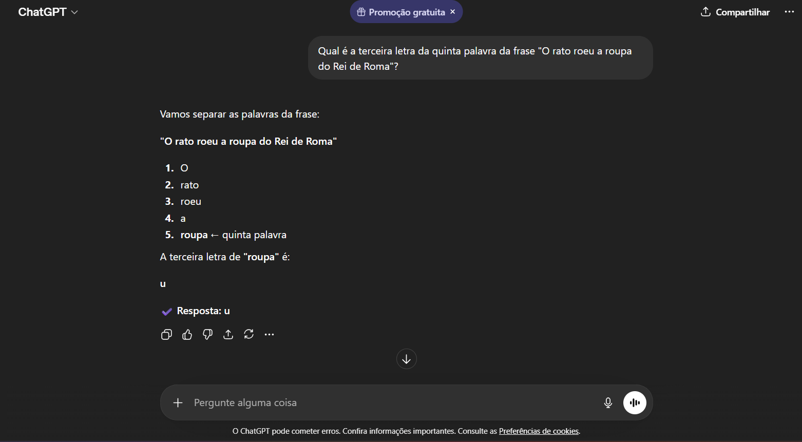

<h2 align="center">Análise de Tokens:</h2>

<h2 align="center">Raciocinio CoT(Chain-of-Thought):</h2>

 
 

  
Conclusão: A divisão de tokens faz com que a I.A processe as informações com mais eficiência, consumindo menos memoria e processamento do modelo e diminuindo erros de interpretação, respostas incompletas e perda de diretrizes de formatação.

